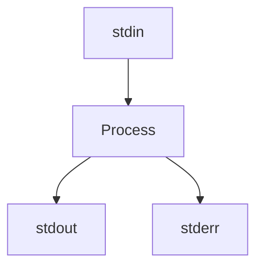
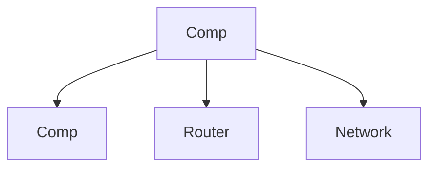
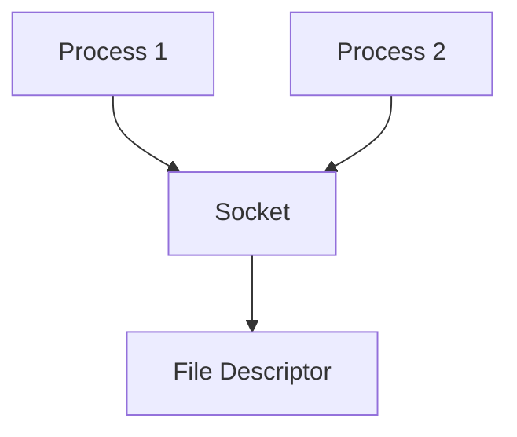
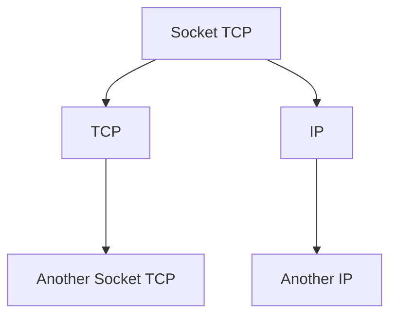
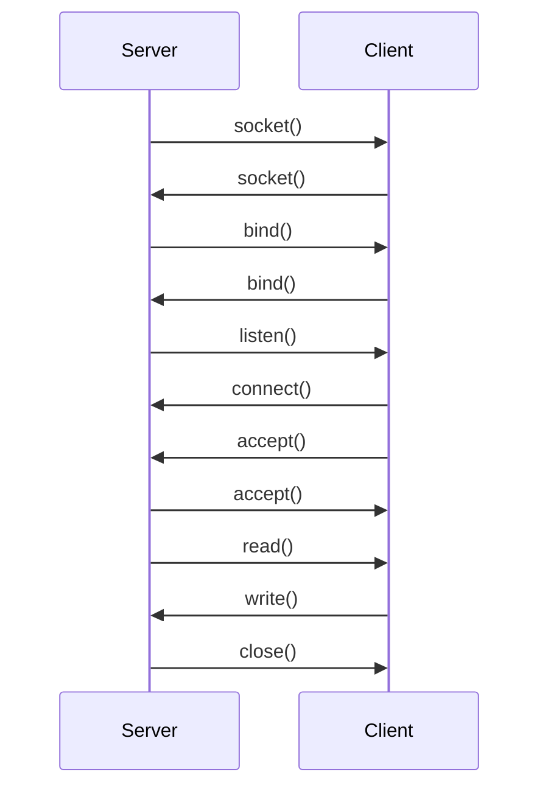
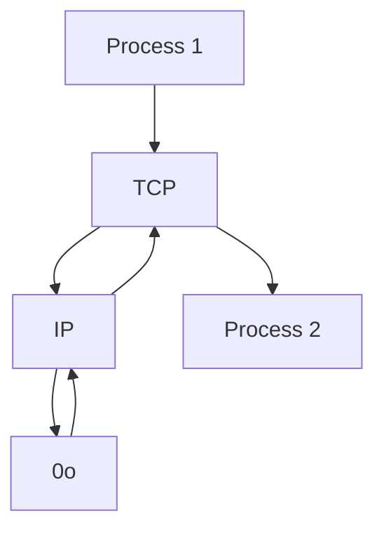
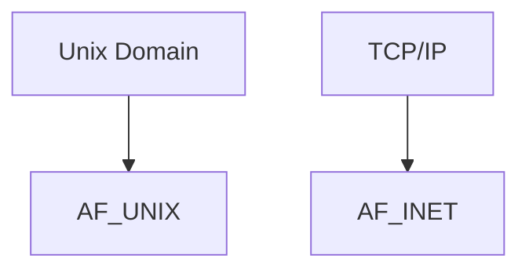
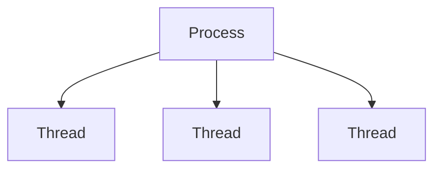

# Desarrollo Unix

## Trainer Notes

* Email:
  * [cesar.flores@fundacion-jala.org](cesar.flores@fundacion-jala.org)

## Introducción

## History

* Started with MULTICS at 1960's
* OS write at Assembly
* Unix write at C
  * Portable

## POSIX (Portable Operating System Interface)

* Define standards
* OS Level interfaces
* User Level interfaces
* Base Utilities
* Common tools to interact with the OS
* Defined on C
* IEEE 1003
* ISO/IEC 9945

## GNU/Linux

* Linux Torvalds, September 1991
* Richard Stallman, GNU Project, 1983
* Distributions
  * Red Hat Linux Enterprice
  * Novell, SUSE Linux Enterprice
  * Debian
  * Canonical, Ubuntu
  * Slockware

  ```mermaid
    graph TD;
        A[GNU] --> B[Linux];
        B --> C[Debian];
        B --> D[Red Hat];
        B --> E[Novell];
        B --> F[Canonical];
        B --> G[Slockware];
  ```

## File System

* FAT32
* NTFS
* EXT3/4
* ZFS
* HFS+
* BTRFS

## Linux File System

* /boot #Boot Images
* /
  * /bin # Main Binaries
  * /dev # Physical Device file pointers
  * /etc # Configuration
  * /proc # Running Process Information
  * /sys # System
  * /var # Variable
  * /tmp # Temporary
  * /usr # General Binary files, libraries, documentation
  * /home # Home

## Themes

* Standard Librart STD
* Program termination status
* Control Structures
  * If
  * Switch
  * For
  * While
* Methods
* Pointers and memory
* Arguments by value, Arguments by reference
* Static Library
* Dynamic Library

### Pointes and Memory

C is a low level language, so it is necessary to manage
the memory manually.

It could be done with & and * operators.

* & is the address of a variable
* * is the value of a pointer

Everytime a pointer is created, it is necessary to free it.

```c
#include <stdio.h>
#include <stdlib.h>

int main() {
  int *p = malloc(sizeof(int));
  *p = 10;
  printf("Value: %d\n", *p);
  free(p);
  return 0;
}
```

### Static and Dinamic libraries

There are different types of libraries in C.

It could be different between static and dynamic libraries.

* Static libraries are linked at compile time
* Dynamic libraries are linked at runtime

They could be:

* .jar
* .dll
* .so
* .a

Like in [this code]($HOME/Projects/repo/UnixDevelopment/Apr15/basics.c)

## Possible Tasks

* Threads
* Processes
  * Fork
* Sockets
* Kernel Modules

## Lenguajes de Programacion

Guillermo Espinola

## Avance de Materia

Paradigmas

Gramaticas libres de contexto

## Lenguajes de programacion a usar

C#

### Programar

Dar instrucciones a una computadora para que realice una tarea.

### Algoritmo

Sucesion de pasos para resolver un problema.

### Lenguaje de programacion

Conjunto de instrucciones que se le dan a una computadora para que realice una tarea.

## Generacion de Lenguajes

### Primera Generacion

Lenguaje que entiende la computadora (0 y 1).

### Segunda Generacion

* Drivers
* Librerias

### Tercera Generacion

* Java
* C#
* C++
* C
* Python

### Cuarta generacion

* SQL

### Quinta generacion

* Haskell
* Prolog

## Paradigmas

### Imperativos

Se le dice a la computadora que hacer y como hacerlo.

### Declarativos

Se le dice a la computadora que hacer pero no como hacerlo.

## Tipos de Lenguajes

### Interpretados

* Python
* Ruby
* JavaScript

### Compilados

* C
* C++
* C#

### Hibridos

* Java
* Python

## Conceptos

### SDK

Software Development Kit (Kit de desarrollo de software) es un conjunto
de herramientas de desarrollo de software que permiten a los
programadores crear aplicaciones para un sistema concreto.

### API

Interfaz de programacion de aplicaciones, es un conjunto de reglas y
especificaciones que las aplicaciones pueden seguir para comunicarse
entre ellas. Se utiliza sobre el protocolo HTTP.

### RestFullAPI

Es una arquitectura que se basa en el protocolo HTTP y en los principios
de REST.

## Memoria

### Stack

Memoria de corto plazo, se borra al cerrar el programa.

### Heap

Memoria de largo plazo, se borra al cerrar la computadora.

## Process

## What's a Process

A process is simply a program in execution. One program stricly has at
least one process associated with it.

* OS
  * Boot
  * Init <* PID 1
    * Process I/O
    * Process Network
    * Process Display
    * Process Desktop
      * Firefox
        * Tabs
          * Google
          * Facebook
          * Twitter

## Utilities to manage process on UNIX

* List and manage process
  * ps
    * If it is with "[  ]" that means that is executed by the kernel
  * kill
* Background and bring it back
  * Ctrl+z
  * bg
  * fg
  * &

When an app get failed it writes a log in the /var/log directory. We can use it
to see what happened.

If we wanna start an app with '&' we can redirect the logs to /dev/null to avoid
the logs to be written in the /var/log directory.

```c
#include <stdio.h>
#include <unistd.h>

int main(int argc, char *argv[]) {
  for (int i = 0; i < 10; i++) {
    printf("i = %d\n", i); 
    sleep(1);
  }
  return 0;
}
```

## Process identifier (PID)

* PID is a number that identifies a process.
* PPID is the parent process identifier.
* Fork is a system call that creates a new process.
* Child Process is the process created by the fork system call.

We can use them in c code in the next way:

```c
#include <stdio.h>
#include <stdlib.h>
#include <unistd.h>
#include <sys/types.h>
#include <sys/wait.h>

int main(int argc, char** argv) {
  pid_t main_pid = getpid();
  pid_t parent_pid = getppid();
  printf("Main process ID: %d\n", main_pid);
  printf("Parent process ID: %d\n", parent_pid);

  pid_t child = fork();
  if (child == 0) {
    // Process child
    printf("Child: PID = %d PPID = %d\n", getpid(), getppid());
    sleep(5);
    printf("Child finish\n");
    exit(0);
  } else {
    // Process parent
    printf("Main: PID = %d PPID = %d\n", getpid(), getppid());
    // Wait until subprocess finish before main process finish.
    wait(NULL);
    printf("Main finish\n");
  }

  return 0;
}
```

This is if process are not sharing a memory space. If they are sharing a memory
we have to use a different approach.

> _**HOMEWORK**_ See what types of wait can be used determine if a process
end with a status or not.
> _**HOMEWORK**_ Three levels of process.

``` diagram
p1 -> print, pid, ppid and counter every second until 10.
|
|-> p2 -> print, pid, ppid and counter every second starting from 10 until 20 

```

## Background

* Streams
  * stadin, stdout, stderr
* Network
  * TCP
  * UDP
  * Unix Sockets
* Files
  * Block of information stored at some place.
  * Unix also uses it as a pointer to some block of the memory/kernel

> stdin is the standard input, stdout is the standard output and stderr is the
standard error.





### Files

* File description
* File descriptor
* Operations
  * Open
  * Read
  * Write
  * Close
* Options at time to open
  * O_RDONLY
  * O_WRONLY
  * O_RDWR
  * O_TRUNC
  * O_APPEND
  * O_CREAT

File descriptor is a number that the kernel uses to identify the file.

File description is a structure that the kernel uses to manage the file.

## Pipes

* | Operator at shell
* Producer/Consumer problem
  * Producer blocks if buffer is full
  * Consumer blocks if buffer is empty
  * Data inconsistency ifbuffer is write and read at same time

## Pipes C (Unnamed)

* pipe()
* one way only (half duplex)
* fd[0] read
* fd[1] write

## Named Pipes (FIFO)

* mkfifo()
* looks like a file, but is a special file
* beyond the file of theprocess
* any process can open it for read or write
* it needs to be open in both sides before to use it

> _**HOMEWORK**_ Create a chat with pipes

## Shared memory

* OS assigns memory to each process
* Fastest way to comunicate Processes
* Request memory segment to the OS
* OS gives to the process a segment memory
  * shmget(key_t, size_t, size, int shmflg)
  * shmat(int shmid, const void *shmaddr, int shmflg)
  * shmdt(const void *shmaddr)
  * shmctl()

> _**HOMEWORK**_ Spike when the OS undo shared memory

### Memory Mapped Files

* void *mmap(void* addr, size_t length, int prot, int flags, int fd, off_t offset)
  * addr, if NULL OS assign the starting address
  * length, size of the locations in bytes
  * prot, protection level
    * PROT_EXEC, PROT_READ, PROT_WRITE, PROT_NONE
  * flags, configure the page
    * MAP_SHARED, MAP_PRIVATE, MAP_ANONYMOUS(MAP_ANON)
  * fd, file descriptor (-1 if MAP_ANONYMOUS)
  * offset, start position in bytes
* munmap(void *addr, size_t length)
  * addr, address of location to free (what mmpa() returned))
  * length, the area of memory to free

## Message Queue

* Queue
  * Linear structured data
  * FIFO (First In First Out)
* Structured messages
* Associated with metadata
  * int msgget(key_t key, int msgflg)
  * int msgsnd(int msqid, const void *msgp, size_t msgsz, int msgflg)
  * int msgrcv(int msqid, void *msgp, size_t msgsz, long msgtyp, int msgflg)
    * msgtype == 0, reads the first message
    * IPC_NOWAIT
  * int msgctl(int msqid, int cmd, struct msqid_ds *buf)
    * cmd: IPC_STAT, IPC_SET, IPC_RMID, IPC_INFO

## Semaphores

* Normal variable
* Coordinate activities between multiple process
* Mutual exclusion
* Wail Operation (P)
  * Decrements the variable
* Signal Operation (V)
  * Increments the variable

## Binary Semaphores

* Values are 0 or 1 
* Used to control resources that has only one ininstances

## Counting Semaphores

* Values can be as much as we need
* Used to control resources that has multiple instances

## External Process Open Signals

### Process Open - Process call

* Interact with other process by regular I/O
* popen, POSIX implementation
* system, if there is no need to interact with the created process
* exec, has variations and is based on execve
  * "replace" the actual program with new program

### Signals

* Software interruption or notification
* Inter-process communication for exceptional situations
* communication between process and OS
* Type of signals
  * SIGHUP, Hangup the process
  * SIGINT, Interrupt from keyboard
  * SIGQUIT, Quit from keyboard
  * SIGILL, Illegal instruction
  * SIGTRAP, Trace trap
  * SIGABRT, Abort
  * SIGSEGV, Segmentation fault
  * SIGTERM, Termination signal
  * SIGSTOP, Stop process
  * SIGCONT, Continue process with paused process
* Default actions taken by the OS
* int kill(pid_t pid, int sig)
  * send a signal to the process with the pid
* int raise(int sig)
  * send a signal to the process that calls the function

### Signals Handlers

* Function that is executed when a signal is received by the process
* The OS take control and executes the registered handler
* signal(SIG_CONSTANT, signalHandlerFunction);

## Sockets

* Another way to communnicate two or more processes
* It can be UNIX Domain Sockets
* TCP/UDP sockets





## Unix Domain Sockets (AF_UNIX)

* An IPC between procesees
* Unnamed sockets
* Bound to the filesystem path
* Types
  * SOCK_STREAM, stream oriented socket, reliable (TCP)
  * SOCK_DGRAM, datagram oriennted socket, non-reliable (UDP)
* int socket(int domain, int type, int protocol)
* int listen(int socket_fd, int n)
* int accept(int socket, struct sockaddr *address, socklen_t *address_len_ptr)
* int connect(int socket, struct sockaddr *addr, socklen_t lenght)

We can see the flow in the next secuence diagram



It can be implemented in C code like this:

#### Server

```c
#include <stdio.h>
#include <sys/socket.h>
#include <sys/un.h>
#include <unistd.h>
#include <string.h>

#define MAX_CONNECTION 5
#define MESSAGE_SIZE 256

int main(int argc, char *argv[]) {
  
  int server_socket_fd;
  char* socket_path = "/tmp/ipc_socket";

  int unlink_status = unlink(socket_path);
  if (unlink_status == -1) {
    perror("Error at unlink");
    return 7;
  }

  server_socket_fd = socket(AF_UNIX, SOCK_STREAM, 0);
  if (server_socket_fd == -1) {
    perror("Error at socket init.");
      return 1;
  }

  struct sockaddr_un server_addr;

  server_addr.sun_family = AF_UNIX;
  strcpy(server_addr.sun_path, socket_path);


  int bind_status = bind(server_socket_fd,
       (struct sockaddr*) &server_addr, 
       sizeof(server_addr));
  if (bind_status == -1) {
    perror("Error at bind");
    return 2;
  }
  
  int listen_status = listen(server_socket_fd, MAX_CONNECTION);
  if (listen_status == -1) {
    perror("Error at listening");
    return 3;
  }

  struct sockaddr_un client_addr;
  int client_addr_size = sizeof(client_addr);
  int client_socket_fd = accept(server_socket_fd,
         (struct sockaddr*) &client_addr,
         (socklen_t *) &client_addr_size);
  if (client_socket_fd == -1) {
    perror("Error at requiest");
    return 4;
  }

  char buffer[MESSAGE_SIZE];
  int read_status = read(client_socket_fd, &buffer, MESSAGE_SIZE);
  if (read_status == -1) {
    perror("Error at read");
    return 5;
  }
  printf("Message from client: %s\n", buffer);

  int write_status = write(client_socket_fd, "Hello from server", 18);
  if (write_status == -1) {
    perror("Error at write");
    return 6;
  }

  close(client_socket_fd);
  close(server_socket_fd);

  return 0;

}
```

#### Client

```c
#include <stdio.h>
#include <sys/socket.h>
#include <sys/un.h>
#include <unistd.h>
#include <string.h>

#define MESSAGE_SIZE 256

int main(int argc, char *argv[]) {

  int server_socket_fd;
  char* socket_path = "/tmp/ipc_socket";
  server_socket_fd = socket(AF_UNIX, SOCK_STREAM, 0);
  if (server_socket_fd == -1) {
    perror("Error at socket init.");
    return 1;
  }

  struct sockaddr_un server_socket_addr;
  server_socket_addr.sun_family = AF_UNIX;
  strcpy(server_socket_addr.sun_path, socket_path);
  int connection_status = connect(server_socket_fd,
          (struct sockaddr*) &server_socket_addr,
          sizeof(server_socket_addr));
  if (connection_status == -1) {
    perror("Error at connection");
    return 2;
  }

  int write_status = write(server_socket_fd, "Hello from client", 18);
  if (write_status == -1) {
    perror("Error at write");
    return 3;
  }

  char response[18];
  int read_status = read(server_socket_fd, response, 18);
  if (read_status == -1) {
    perror("Error at reading response");
    return 4;
  }

  printf("Response from server: %s\n", response);

  close(server_socket_fd);

  return 0;
}
```

## TCP/UDP Sockets (AF_INET)

* to communicate processes no matter where they are running
* It uses file descriptors
* Base for clien server architecture
* Server stages
  * Socket
  * Bind
  * listen
  * Accept
  * Read/Write
* Client Stages
  * Socket
  * Connect
  * Read/Write
  * Close

Comparing TCP/IP and Unix domain for local IPC between two sockets





It can be implemented in C code like this:

#### Server

```c
#include <stdio.h>
#include <sys/socket.h>
#include <sys/un.h>
#include <unistd.h>
#include <netinet/in.h>
#include <arpa/inet.h>

#define MAX_CONNECTION 5
#define MESSAGE_SIZE 256

int main(int argc, char *argv[]) {
  
  int server_socket_fd;
  server_socket_fd = socket(AF_INET, SOCK_STREAM, 0);
  if (server_socket_fd == -1) {
    perror("Error at socket init.");
      return 1;
  }

  struct sockaddr_in server_addr;

  server_addr.sin_family = AF_INET;
  server_addr.sin_addr.s_addr = inet_addr("127.0.0.1");
  server_addr.sin_port = htons(9292);

  int bind_status = bind(server_socket_fd,
       (struct sockaddr*) &server_addr, 
       sizeof(server_addr));
  if (bind_status == -1) {
    perror("Error at bind");
    return 2;
  }
  
  int listen_status = listen(server_socket_fd, MAX_CONNECTION);
  if (listen_status == -1) {
    perror("Error at listening");
    return 3;
  }

  struct sockaddr_in client_addr;
  int client_addr_size = sizeof(client_addr);
  int client_socket_fd = accept(server_socket_fd,
         (struct sockaddr*) &client_addr,
         (socklen_t *) &client_addr_size);
  if (client_socket_fd == -1) {
    perror("Error at requiest");
    return 4;
  }

  char buffer[MESSAGE_SIZE];
  int read_status = read(client_socket_fd, &buffer, MESSAGE_SIZE);
  if (read_status == -1) {
    perror("Error at read");
    return 5;
  }
  printf("Message from client: %s\n", buffer);

  int write_status = write(client_socket_fd, "Hello from server", 18);
  if (write_status == -1) {
    perror("Error at write");
    return 6;
  }

  close(client_socket_fd);
  close(server_socket_fd);

  return 0;

}
```

#### Client

```c
#include <stdio.h>
#include <sys/socket.h>
#include <sys/un.h>
#include <unistd.h>
#include <netinet/in.h>
#include <arpa/inet.h>

#define MESSAGE_SIZE 256

int main(int argc, char *argv[]) {

  int server_socket_fd;

  struct sockaddr_in server_socket_addr;
  server_socket_addr.sin_family = AF_INET;
  server_socket_addr.sin_addr.s_addr = inet_addr("127.0.0.1");
  server_socket_addr.sin_port = htons(9292);
  int connection_status = connect(server_socket_fd,
          (struct sockaddr*) &server_socket_addr,
          sizeof(server_socket_addr));
  if (connection_status == -1) {
    perror("Error at connection");
    return 2;
  }

  int write_status = write(server_socket_fd, "Hello from client", 18);
  if (write_status == -1) {
    perror("Error at write");
    return 3;
  }

  char response[18];
  int read_status = read(server_socket_fd, response, 18);
  if (read_status == -1) {
    perror("Error at reading response");
    return 4;
  }

  printf("Response from server: %s\n", response);

  close(server_socket_fd);

  return 0;
}
```
## Threads (pthreads)

* Similar to a different process
* Lightweight process
* Share resources with the main process
* Improve execution by parallelism
* Faster context switch
* Communication between threads are faster



## POSIX threads - pthreads

* C has not a standard library for threads
* POSIX specification for threads
* Thread library based on the standards
* Unique thread ID

### GCC pthreads

* require additional library
  * gcc -o program program.c -lpthread
* int pthread_create(pthread_t *thread, pthread_attr_t *attr, 
void *(*start_routine) (void *), void *arg)
* int pthread_join(pthread_t thread, void **retval)
* return 0 for success, another integer positive

```c
#include <stdio.h>
#include <pthread.h>
#include <unistd.h>

int g_v = 0;

void* do_increment_work() {
  pthread_t t_id =  pthread_self();
  printf("Thread[%lu] - doing increment work...\n", t_id);
  sleep(1);
  g_v++;
  printf("Thread[%lu] -  inc: g_v[%d].\n", t_id, g_v);
  printf("Thread[%lu] - increment done.\n", t_id);
  return NULL;
}

void* do_decrement_work() {
  pthread_t t_id =  pthread_self();
  printf("Thread[%lu] - doing decrement work...\n", t_id);
  sleep(1);
  g_v--;
  printf("Thread[%lu] - done decrement.\n", t_id);
  return NULL;
}


int main(int argc, char** argv) {

  int threads = 8;
  pthread_t inc_thread_ids[threads];
  pthread_t dec_thread_ids[threads];

  for (int i = 0; i < threads; i++) {
    int t_status =
      pthread_create(&inc_thread_ids[i], NULL, do_increment_work, NULL);
    if (t_status == -1) {
      perror("Error creating thread.");
      return 1;
    }
  }

  for (int i = 0; i < threads; i++) {
    int t_status =
      pthread_create(&inc_thread_ids[i], NULL, do_increment_work, NULL);
    if (t_status == -1) {
      perror("Error creating thread.");
      return 1;
    }
  }

  for (int i = 0; i < threads; i++) {
    int t_status =
      pthread_create(&dec_thread_ids[i], NULL, do_decrement_work, NULL);
    if (t_status == -1) {
      perror("Error creating thread.");
      return 1;
    }
  }
  for (int i = 0; i < threads; i++) {
    int join_status = 
      pthread_join(dec_thread_ids[i], NULL);
    if (join_status == -1) {
      perror("Error joining thread.");
      return 2;
    }
  }

  printf("Finishing main \n");

  return 0;
}
```

## Multi thread Synchronization

* Shared variables are accessible for all threads
* Mutual exclusion (mutex)
* Producer-consumer problem
* Semaphores
* Thread safe programming

```c
#include <stdio.h>
#include <pthread.h>
#include <unistd.h>

int g_v = 0;
pthread_mutex_t gv_mutex;

void* do_increment_work(int* count) {
  printf("Count is %d\n", *count);
  *count = *count + 1;
  pthread_t t_id =  pthread_self();
  printf("Thread[%lu] - doing increment work...\n", t_id);
  // Lock
  pthread_mutex_lock(&gv_mutex);
  g_v++;
  // Unlock
  pthread_mutex_unlock(&gv_mutex);
  printf("Thread[%lu] -  inc: g_v[%d].\n", t_id, g_v);
  printf("Thread[%lu] - increment done.\n", t_id);
  return NULL;
}

void* do_decrement_work() {
  pthread_t t_id =  pthread_self();
  printf("Thread[%lu] - doing decrement work...\n", t_id);
  // Lock
  pthread_mutex_lock(&gv_mutex);
  g_v--;
  // Unlock
  pthread_mutex_unlock(&gv_mutex);
  printf("Thread[%lu] -  dec: g_v[%d].\n", t_id, g_v);
  printf("Thread[%lu] - done decrement.\n", t_id);
  return NULL;
}


int main(int argc, char** argv) {

  int threads = 8;
  int count = 0;
  pthread_t inc_thread_ids[threads];
  pthread_t dec_thread_ids[threads];
  pthread_mutex_init(&gv_mutex, NULL);

  for (int i = 0; i < threads; i++) {
    int t_status =
      pthread_create(&inc_thread_ids[i], NULL, do_increment_work, (*void)&count);
    if (t_status == -1) {
      perror("Error creating thread.");
      return 1;
    }
  }

  for (int i = 0; i < threads; i++) {
    int t_status =
      pthread_create(&inc_thread_ids[i], NULL, do_increment_work, (*void)&count);
    if (t_status == -1) {
      perror("Error creating thread.");
      return 1;
    }
  }

  for (int i = 0; i < threads; i++) {
    int t_status =
      pthread_create(&dec_thread_ids[i], NULL, do_decrement_work, NULL);
    if (t_status == -1) {
      perror("Error creating thread.");
      return 1;
    }
  }
  for (int i = 0; i < threads; i++) {
    int join_status = 
      pthread_join(dec_thread_ids[i], NULL);
    if (join_status == -1) {
      perror("Error joining thread.");
      return 2;
    }
  }

  pthread_mutex_destroy(&gv_mutex);
  printf("Finishing main \n");

  return 0;
}
```

## OS Space

* OS Kernel has its own memory space
* User space does not have direct access to kernel space
* Kernel offers an API to interact with user programs

### How to run application on kernel space

* Kernel APIs
* Switch user program to kernel space with syscalls
* Run inside of kernel as a kernel module

## Common syscalls

* proocess creation, fork
* File operations
  * open
  * write
  * read
  * close
* Network Operations
  * socket
  * bind
  * listen
  * accept
  * connect
  * close

## Kernel Modularity

  * Piece of code that can dynamically load and unload into OS kernet at runtime
  * Extend kernel functionality
  * install device drivers without restart the OS
  * Fix bugs without impacting entire kernel
  * i.e.
    * nvidia
    * snd_hda_intel
    * iwlwifi

### How to build a kernel module

  * Dependencies
    * `gcc make build-essentia libncurses-dev exuberant-ctags`
  * module information/metadata
  * module_init()
  * module_exit()
  * makefile
    * obj.m += dvt.driver.o
    * all:
      * `make -C /lib/modules/$(shell uname -r)/build M=$(PWD) modules`
    * clean:
      * `make -C /lib/modules/$(shell uname -r)/build M=$(PWD) clean`
